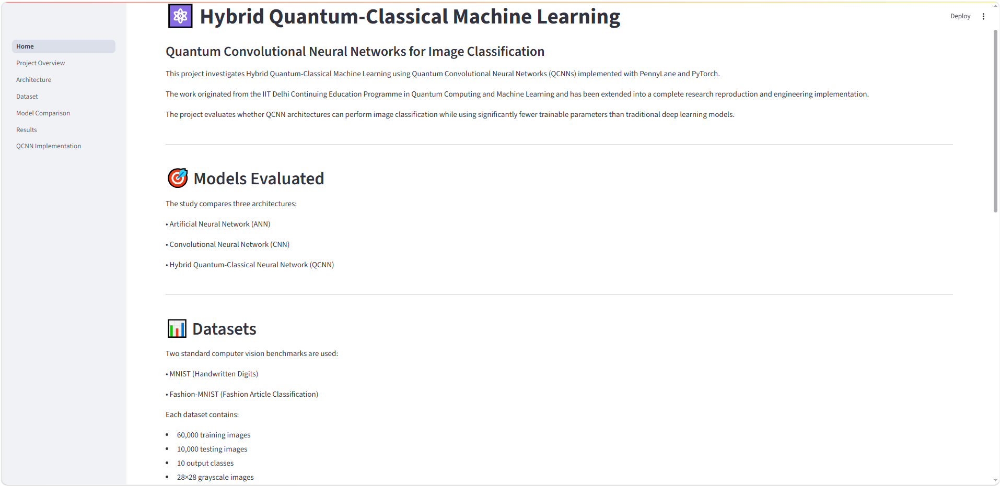
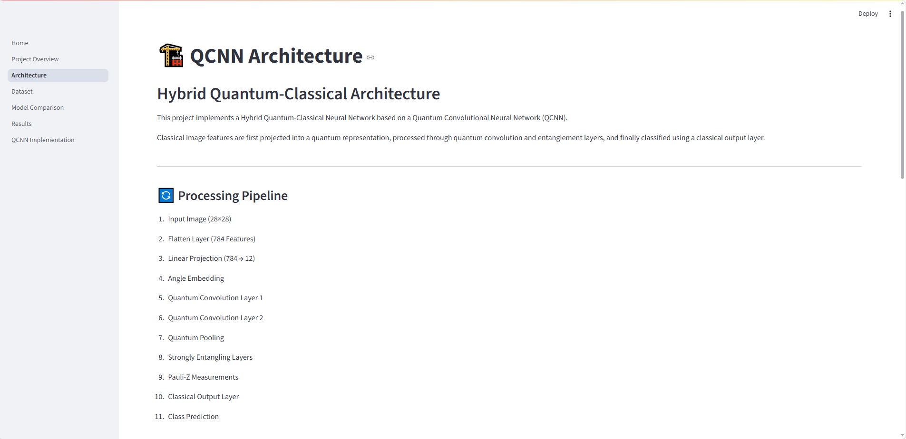
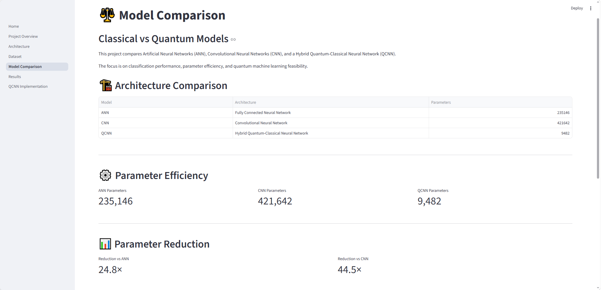
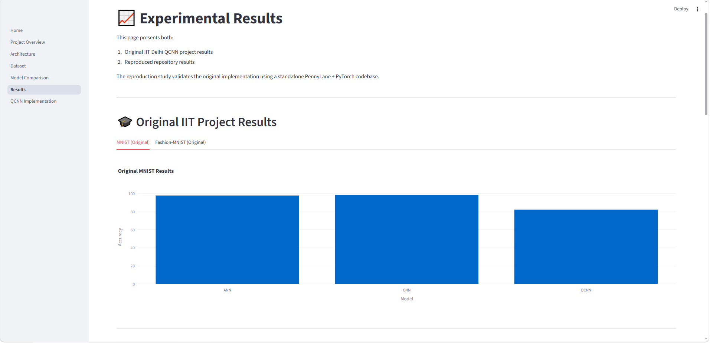
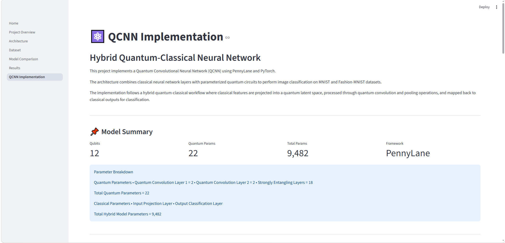

# ⚛️ Hybrid Quantum Convolutional Neural Network (QCNN) for Image Classification

[](https://hybrid-qcnn-classification-tiakml9nkoflebb7uthkub.streamlit.app/)


---

## 🌐 Live Demo

Launch the deployed Streamlit application:

**<https://hybrid-qcnn-classification-tiakml9nkoflebb7uthkub.streamlit.app/>**

---

## 📖 Project Overview

Hybrid Quantum Convolutional Neural Networks (QCNNs) represent one of the earliest practical approaches toward Quantum Machine Learning for computer vision tasks.

This repository reproduces and extends an IIT Delhi Quantum Computing and Machine Learning project by implementing a complete Hybrid Quantum-Classical image classification pipeline using:

- PennyLane
- PyTorch
- Streamlit
- MNIST
- Fashion-MNIST

Unlike the original academic notebook, this repository has been transformed into a production-quality engineering project with a modular architecture, reusable inference engine, pretrained checkpoints, interactive dashboards, and deployment support.

The repository now includes:

- Professional project structure
- Modular source code
- Interactive Streamlit dashboards
- Live image inference
- Live ANN vs CNN vs QCNN comparison
- Shared preprocessing pipeline
- Cached model loading
- Pretrained checkpoints
- Reproducible experiments
- Complete research documentation

---

## 🚀 Key Features

### Quantum Machine Learning

- Hybrid Quantum-Classical Neural Network
- Quantum Convolutional Neural Network (QCNN)
- Variational Quantum Circuits
- Angle Embedding
- Quantum Pooling
- Strongly Entangling Layers
- PennyLane integration

### Deep Learning

- Artificial Neural Network (ANN)
- Convolutional Neural Network (CNN)
- PyTorch implementation
- Shared preprocessing pipeline
- Model benchmarking

### Interactive Dashboard

The Streamlit application includes:

- Home
- Project Overview
- Architecture
- Dataset
- Model Comparison
- Experimental Results
- QCNN Implementation
- Live Inference
- Live Model Comparison

---

## 📂 Repository Resources

| Resource                 | Link / Description                                                                                    |
| :----------------------- | :---------------------------------------------------------------------------------------------------- |
| 🌐 Live Demo             | [Hybrid QCNN Streamlit App](https://hybrid-qcnn-classification-tiakml9nkoflebb7uthkub.streamlit.app/) |
| 💻 GitHub Repository     | [srikco06-ai/hybrid-qcnn-classification](https://github.com/srikco06-ai/hybrid-qcnn-classification)   |
| 📄 Project Report        | `docs/QCNN_Report_V1.0.pdf`                                                                           |
| 📊 Presentation          | `docs/GROUP-8_QCNN_MINST_FashionMNIST.pptx`                                                           |
| ⚛️ Live Inference        | Interactive image classification using pretrained ANN, CNN, and QCNN models                           |
| 📈 Live Model Comparison | Side-by-side comparison of ANN, CNN, and QCNN predictions on the same uploaded image                  |

---

## 📊 Project Highlights

| Metric | Value |
| :----- | ----: |
| Framework | PennyLane |
| Backend | PyTorch |
| Frontend | Streamlit |
| Datasets | 2 |
| Models | 3 |
| Quantum Parameters | 22 |
| QCNN Parameters | 9,482 |
| CNN Parameters | 421,642 |
| ANN Parameters | 235,146 |

---

## 🔬 Main Findings

The reproduced QCNN demonstrates that parameterized quantum circuits can perform meaningful image classification while using significantly fewer trainable parameters than conventional deep learning models.

Key observations include:

- QCNN achieves competitive image classification performance.
- QCNN uses approximately **44× fewer parameters** than the CNN baseline.
- CNN provides the highest classification accuracy.
- QCNN demonstrates exceptional parameter efficiency.
- Hybrid quantum models remain computationally slower but substantially smaller than deep CNN architectures.

## 📁 Repository Structure

```text
hybrid-qcnn-classification/

├── app/
│   ├── Home.py
│   └── pages/
│       ├── 1_Project_Overview.py
│       ├── 2_Architecture.py
│       ├── 3_Dataset.py
│       ├── 4_Model_Comparison.py
│       ├── 5_Results.py
│       ├── 6_QCNN_Implementation.py
│       ├── 7_Live_Inference.py
│       └── 8_Model_Comparison_Live.py
│
├── docs/
│   ├── QCNN_Report_V1.0.pdf
│   └── GROUP-8_QCNN_MINST_FashionMNIST.pptx
│
├── sample_images/
│   ├── mnist/
│   └── fashion_mnist/
│
├── screenshots/
│
├── src/
│   ├── classical/
│   ├── quantum/
│   ├── inference/
│   ├── training/
│   ├── models/
│   └── utils.py
│
├── tools/
│
├── README.md
├── requirements.txt
├── runtime.txt
└── LICENSE
```

---

## 🖼️ Application Screenshots

### Home Dashboard



The landing page introduces the project, summarizes the research objective, presents the evaluated models, and provides quick navigation to every module.

---

### Architecture Dashboard



The architecture page explains the complete Hybrid Quantum-Classical pipeline, from image preprocessing through quantum feature embedding, quantum convolution, measurement, and final classification.

---

### Model Comparison Dashboard



Compare ANN, CNN, and QCNN in terms of architecture, parameter count, computational complexity, and parameter efficiency.

---

### Experimental Results Dashboard



Displays benchmark results from the original IIT Delhi implementation alongside the independently reproduced experiments contained in this repository.

---

### QCNN Implementation Dashboard



Explains the internal structure of the Hybrid QCNN, parameter allocation, quantum circuit design, and implementation details.

---

### Live Inference Dashboard

The Live Inference page enables users to:

- Upload custom images
- Select a dataset
- Select a pretrained model
- Execute inference
- Display confidence scores
- View probability distributions
- Inspect Top-3 predictions
- Review prediction metadata

---

### Live Model Comparison Dashboard

Run the same uploaded image through:

- ANN
- CNN
- QCNN

and compare:

- Predictions
- Confidence scores
- Inference time
- Probability distributions
- Top-3 predictions
- Raw prediction JSON

---

## 🛠️ Technology Stack

### Quantum Computing

- PennyLane
- Variational Quantum Circuits
- Angle Embedding
- Quantum Convolution
- Quantum Pooling
- Strongly Entangling Layers

### Machine Learning

- PyTorch
- NumPy
- Pandas
- Scikit-Learn

### Visualization

- Streamlit
- Plotly
- Matplotlib

### Development Tools

- Python
- Git
- GitHub
- Visual Studio Code

---

## 📚 Datasets

Two benchmark datasets are used throughout the project.

### MNIST

| Property | Value |
| :------- | :---- |
| Images | 70,000 |
| Training | 60,000 |
| Testing | 10,000 |
| Resolution | 28 × 28 |
| Channels | 1 |
| Classes | 10 |

Used for handwritten digit classification.

---

### Fashion-MNIST

| Property | Value |
| :------- | :---- |
| Images | 70,000 |
| Training | 60,000 |
| Testing | 10,000 |
| Resolution | 28 × 28 |
| Channels | 1 |
| Classes | 10 |

Used for grayscale fashion article classification.

---

## 📈 Original IIT Delhi Results

### MNIST Original IIT Delhi Results

| Model | Accuracy |
| :---- | -------: |
| ANN | 98.00% |
| CNN | **98.81%** |
| QCNN | 82.35% |

---

### Fashion-MNIST Original IIT Delhi Results

| Model | Accuracy |
| :---- | -------: |
| ANN | 88.74% |
| CNN | **92.06%** |
| QCNN | 59.35% |

These results serve as the reference baseline for this repository.

---

## 🔄 Reproduced Results

The complete training pipeline was independently reproduced using PennyLane and PyTorch.

Minor numerical differences are expected due to:

- Random weight initialization
- Optimizer behavior
- Software versions
- Floating-point precision
- Hardware configuration

### MNIST Reproduced Results

| Model | Accuracy |
| :---- | -------: |
| ANN | 97.49% |
| CNN | **99.12%** |
| QCNN | 82.31% |

---

### Fashion-MNIST Reproduced Results

| Model | Accuracy |
| :---- | -------: |
| ANN | 87.34% |
| CNN | **91.59%** |
| QCNN | 78.44% |

---

## 📊 Performance Comparison

The following table summarizes the overall performance of each model.

| Metric | ANN | CNN | QCNN |
| :----- | ---: | ---: | ---: |
| MNIST Accuracy | 97.49% | **99.12%** | 82.31% |
| Fashion-MNIST Accuracy | 87.34% | **91.59%** | 78.44% |
| Parameters | 235,146 | 421,642 | **9,482** |
| Quantum Circuit | ❌ | ❌ | ✅ |
| PennyLane | ❌ | ❌ | ✅ |
| PyTorch | ✅ | ✅ | ✅ |
| Live Inference | ✅ | ✅ | ✅ |

---

## ⚡ Parameter Efficiency

One of the primary motivations for Quantum Machine Learning is reducing model complexity while maintaining meaningful predictive performance.

The implemented QCNN demonstrates remarkable parameter efficiency.

| Model | Trainable Parameters |
| :---- | -------------------: |
| ANN | 235,146 |
| CNN | 421,642 |
| QCNN | **9,482** |

### Parameter Reduction

Compared to ANN:

- **≈25× fewer parameters**

Compared to CNN:

- **≈44× fewer parameters**

Although the QCNN does not outperform the CNN in raw accuracy, it achieves competitive classification performance using a dramatically smaller parameter space.

---

## 🧠 QCNN Architecture

The Hybrid Quantum Convolutional Neural Network combines classical preprocessing with parameterized quantum circuits.

```text
Input Image
      │
      ▼
Image Flattening
      │
      ▼
Linear Projection
      │
      ▼
12-D Feature Vector
      │
      ▼
Angle Embedding
      │
      ▼
Quantum Convolution Layer
      │
      ▼
Quantum Pooling Layer
      │
      ▼
Strongly Entangling Layers
      │
      ▼
Pauli-Z Measurement
      │
      ▼
Classical Output Layer
      │
      ▼
Prediction
```

---

## 🔬 Quantum Circuit Components

The QCNN consists of several reusable quantum building blocks.

### Angle Embedding

Maps normalized classical features into quantum states using parameterized rotations.

### Quantum Convolution

Applies trainable quantum filters that learn local feature representations analogous to classical convolution kernels.

### Quantum Pooling

Reduces quantum feature dimensionality while preserving important information.

### Strongly Entangling Layers

Introduce quantum entanglement and improve expressive capability by coupling qubits through trainable rotations.

### Measurement Layer

Expectation values of Pauli-Z operators are measured and passed to the final classical classifier.

---

## 📐 QCNN Parameter Breakdown

| Component | Parameters |
| :-------- | ---------: |
| Input Projection | Classical |
| Quantum Convolution Layer 1 | 2 |
| Quantum Convolution Layer 2 | 2 |
| Strongly Entangling Layers | 18 |
| Total Quantum Parameters | **22** |
| Total Hybrid Parameters | **9,482** |

The majority of trainable parameters remain in the classical projection layer, while the quantum circuit itself uses only **22 trainable quantum parameters**.

---

## 📈 Experimental Analysis

### Artificial Neural Network (ANN)

#### Advantages ANN

- Fast inference
- Simple architecture
- Low computational overhead
- Easy to train

#### Limitations ANN

- Weak spatial feature extraction
- Lower accuracy than CNN
- Limited representational capacity

---

### Convolutional Neural Network (CNN)

#### Advantages CNN

- Highest classification accuracy
- Excellent feature extraction
- Strong generalization performance

#### Limitations CNN

- Highest parameter count
- Larger memory footprint
- Increased computational complexity

---

### Quantum Convolutional Neural Network (QCNN)

#### Advantages QCNN

- Extremely compact architecture
- Excellent parameter efficiency
- Quantum-enhanced feature representation
- Demonstrates practical hybrid quantum learning

#### Limitations QCNN

- Lower accuracy than CNN
- Slower inference due to quantum simulation
- Limited by current quantum hardware capabilities

---

## 🏁 Key Findings

The reproduced experiments validate the central hypothesis of the original research.

- CNN achieved the highest classification accuracy.
- QCNN reproduced meaningful image classification performance.
- QCNN required approximately **44× fewer parameters** than the CNN baseline.
- Hybrid quantum models remain computationally slower because inference is performed through quantum simulation.
- The architecture demonstrates the feasibility of integrating PennyLane quantum circuits with modern PyTorch workflows.

---

## ⚙️ Engineering Improvements

Compared with the original notebook implementation, this repository has been substantially refactored.

Major improvements include:

- Modular project architecture
- Shared inference engine
- Centralized preprocessing pipeline
- Reusable model loader
- Cached checkpoint loading
- Modular Streamlit dashboards
- Interactive live inference
- Multi-model comparison dashboard
- Utility scripts for dataset export
- Pretrained model checkpoints
- Streamlit Cloud deployment
- Reproducible project structure

These changes make the repository easier to maintain, extend, and deploy while preserving the original research objectives.

---

## 🖥️ Live Inference Workflow

The Live Inference dashboard enables interactive prediction using pretrained models.

Workflow:

1. Upload an image (PNG or JPG).
2. Select the dataset (MNIST or Fashion-MNIST).
3. Choose a pretrained model (ANN, CNN, or QCNN).
4. Execute inference.
5. View:
   - Predicted class
   - Confidence score
   - Inference time
   - Probability distribution
   - Top-3 predictions
   - Raw prediction JSON

---

## 📊 Live Model Comparison Workflow

The Live Model Comparison dashboard performs inference across all three models simultaneously.

Each uploaded image is processed using the same preprocessing pipeline before being passed to:

- ANN
- CNN
- QCNN

The dashboard compares:

- Predicted class
- Confidence
- Inference time
- Probability distribution
- Top-3 predictions
- Raw JSON output

This ensures a fair comparison across all architectures using identical inputs.

---

## 💻 Installation

Clone the repository.

```bash
git clone https://github.com/srikco06-ai/hybrid-qcnn-classification.git
```

Navigate into the project.

```bash
cd hybrid-qcnn-classification
```

Create a virtual environment.

```bash
python -m venv venv
```

Activate the environment.

### Windows

```bash
venv\Scripts\activate
```

### Linux / macOS

```bash
source venv/bin/activate
```

Install dependencies.

```bash
pip install -r requirements.txt
```

---

## ▶️ Running the Application

Launch the Streamlit dashboard.

```bash
streamlit run app/Home.py
```

Open your browser and navigate to:

```text
http://localhost:8501
```

---

## 📂 Sample Images

Example images are included for quick testing.

```text
sample_images/

├── mnist/
│   ├── mnist_0.png
│   ├── ...
│   └── mnist_9.png
│
└── fashion_mnist/
    ├── fashion_0_tshirt_top.png
    ├── ...
    └── fashion_9_ankle_boot.png
```

These images can be uploaded directly into the **Live Inference** and **Live Model Comparison** dashboards.

---

## 🛠️ Utility Scripts

The repository includes helper scripts for exporting sample images from both datasets.

Export MNIST samples:

```bash
python tools/export_mnist_samples.py
```

Export Fashion-MNIST samples:

```bash
python tools/export_fashion_mnist_samples.py
```

---

## 🔄 Reproducing the Experiments

To retrain every model from scratch, run the following scripts.

### Artificial Neural Network

```bash
python src/training/train_ann.py
python src/training/train_ann_fashion.py
```

### Convolutional Neural Network

```bash
python src/training/train_cnn.py
python src/training/train_cnn_fashion.py
```

### Quantum Convolutional Neural Network

```bash
python src/training/train_qcnn.py
python src/training/train_qcnn_fashion.py
```

Trained checkpoints will be stored in:

```text
src/models/checkpoints/
```

---

## 🚀 Future Work

Possible extensions include:

- Quantum Vision Transformers (QViT)
- Quantum Residual Networks
- Quantum Transfer Learning
- Data Re-uploading Architectures
- CIFAR-10 Classification
- Medical Image Classification
- IBM Quantum Hardware Execution
- Noise-aware Quantum Training
- Quantum Model Compression
- Larger Benchmark Datasets
- Performance Optimization
- Additional Hybrid Quantum Architectures

---

## ⚠️ Known Limitations

Current limitations include:

- QCNN is evaluated using a quantum simulator rather than real quantum hardware.
- Quantum inference is slower than classical inference due to simulation overhead.
- Accuracy remains below the CNN baseline.
- Experiments are limited to MNIST and Fashion-MNIST datasets.
- Current implementation focuses on reproducible research rather than production-scale training.

---

## 👨‍💻 Author

### Sri Krishna Chaitanya Ogirala

AI & Machine Learning Engineer

Areas of interest:

- Quantum Computing
- Quantum Machine Learning
- Artificial Intelligence
- Deep Learning
- FastAPI
- Python
- Next.js
- Full-Stack AI Applications

GitHub:

<https://github.com/srikco06-ai>

---

## 🙏 Acknowledgements

This work extends the project completed during the **IIT Delhi Continuing Education Programme in Quantum Computing and Machine Learning**.

The original academic implementation has been refactored into a modular, reproducible, deployment-ready repository featuring:

- Modular project architecture
- Interactive Streamlit dashboards
- Live inference
- Multi-model comparison
- Pretrained checkpoints
- Research documentation
- Reproducible experiments

---

## 📖 Citation

If you use this repository in your research or projects, please cite it as:

```bibtex
@misc{ogirala2026hybridqcnn,
  author       = {Sri Krishna Chaitanya Ogirala},
  title        = {Hybrid Quantum Convolutional Neural Network for Image Classification},
  year         = {2026},
  publisher    = {GitHub},
  howpublished = {\url{https://github.com/srikco06-ai/hybrid-qcnn-classification}}
}
```

---

## 📄 License

This project is licensed under the **MIT License**.

See the `LICENSE` file for additional details.

---

## ⭐ Support

If you found this project useful:

- ⭐ Star the repository
- 🍴 Fork the repository
- 🐛 Report issues
- 💡 Suggest improvements
- 🤝 Submit pull requests

Contributions are welcome.

---

## ⚛️ Hybrid Quantum Convolutional Neural Network (QCNN)

*A reproducible Hybrid Quantum-Classical Machine Learning project built with PennyLane, PyTorch, and Streamlit.*

*From academic research to an interactive engineering portfolio.*
